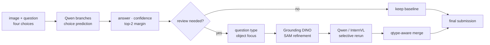

# Recycle VQA Challenge

재활용품 이미지, 자연어 질문, 4지선다 보기를 함께 해석해 정답을 선택하는
multimodal VQA 프로젝트입니다. SSAFY 15기 2회차 AI Challenge에서
**Private score 0.97635, 193개 팀 중 1위, 최우수상**을 기록했습니다.


[전체 포트폴리오](https://github.com/JuHyeon-Nam/JuHyeon-Nam-archive)

## Result

<p align="center">
  
</p>

| Private leaderboard | Public leaderboard |
|---|---|
|  |  |

| Split | Rank | Score |
|---|---:|---:|
| Private | 1st | `0.97635` |
| Public | 1st | `0.96452` |

## Problem

각 sample은 `image`, `question`, `a/b/c/d choices`로 구성되며 최종 출력은 하나의
선택지입니다. 단순 이미지 분류와 달리 질문이 요구하는 속성, 작은 객체의 위치·개수,
보기 사이의 의미 차이를 함께 해석해야 합니다.

주요 실패 조건은 다음과 같았습니다.

- 오답인데도 confidence가 높아 단일 점수만으로 오류를 거르기 어려움
- `count`, `location` 유형에서 작은 객체를 놓치는 오류 집중
- 모든 sample을 대형 모델로 재추론하면 GPU 시간과 비용 증가
- 보기 순서에 따라 예측이 흔들리는 label-position bias 발생

## My Contribution

남주현은 팀원으로 다음 분석과 판단 기준 정리를 담당했습니다.

- 주요 오답 pattern 정리
- InternVL 비교 실험
- 질문 유형별 성능 분석과 분류 기준 정리
- Qwen과 InternVL의 유형별 강점·약점 비교
- 낮은 confidence와 작은 top-1/top-2 margin을 함께 보는 재검토 기준 논의

Qwen 학습, Grounding DINO·SAM 적용, 최종 pipeline 통합은 팀 전체 결과이며
개인 단독 구현으로 표현하지 않습니다.

## Team Solution



### 1. Choice-aware fine-tuning

- Qwen 기반 LoRA·QLoRA fine-tuning
- 생성 문장 대신 `a/b/c/d` choice token을 직접 비교하는 loss 지원
- 보기 순서를 shuffle해 특정 label 위치 암기 완화
- 여러 choice order 결과를 결합하는 test-time augmentation

### 2. Confidence and margin gating

두 branch가 다른 답을 낼 때 confidence 하나만 보지 않고 top-1과 top-2 점수 차이인
`margin_top2`를 함께 기록했습니다. 대체 branch가 충분히 우세할 때만 baseline answer를
교체하고, 선택된 branch와 근거 값은 meta CSV에 남겼습니다.

### 3. Selective rerun

모든 sample을 다시 처리하지 않고 다음 조건에 해당하는 문제만 재추론했습니다.

- 낮은 confidence
- 작은 top-2 margin
- `count` 등 validation에서 확인된 취약 질문 유형

### 4. Focus context

재검토 대상으로 선택된 image는 질문에서 요구하는 객체 후보를 Grounding DINO로 찾고,
필요한 경우 SAM으로 영역을 보정했습니다. 원본 image와 focus context를 함께 사용해
작은 객체를 다시 확인하도록 구성했습니다.

## Troubleshooting

### Confident but wrong predictions

초기 모델은 틀린 답에도 높은 confidence를 보였습니다. 단일 threshold 대신 질문 유형,
branch 일치 여부, confidence와 margin을 함께 기록해 재검토 대상을 정했습니다.

### Small-object count errors

전체 image만 보는 방식은 작은 재활용품을 놓쳤습니다. 취약한 `count` sample에만
detection·crop context를 적용해 모델이 확인할 영역을 좁혔습니다.

### Inference cost

검출기와 여러 VLM을 모든 sample에 적용하는 방식은 비효율적이었습니다. 가벼운 baseline을
먼저 실행하고 불확실한 문제만 multi-stage path로 보내는 cascade 구조를 선택했습니다.

### Choice-order bias

보기 위치가 바뀌면 예측도 달라지는 현상을 줄이기 위해 training shuffle과 inference TTA를
실험했습니다. 최종 answer뿐 아니라 branch별 prediction metadata도 저장해 판단을 추적했습니다.

## Code Map

| File | Role |
|---|---|
| `train_qwen35_choice_ft_prompt.py` | choice-aware Qwen LoRA training and inference |
| `train_qwen35_choice_ft_ori_prompt.py` | alternate prompt branch |
| `internvl_baseline.py` | InternVL comparison baseline |
| `build_margin_baseline_submission.py` | confidence·margin 기반 branch merge |
| `prepare_rerun_subset.py` | answer-free selective rerun sample selection |
| `multistage_vqa.py` | planner, detection, focus context and student ensemble |
| `colab_three_pass_multistage.py` | multi-stage Colab runner |
| `build_final_hybrid_submission.py` | baseline과 rerun 결과 최종 결합 |

## Run

GPU와 CUDA 환경에 맞는 PyTorch를 먼저 설치한 뒤 나머지 package를 설치합니다.

```bash
pip install -r requirements.txt
```

Expected data layout:

```text
project_root/
  train.csv
  test.csv
  images/
```

`train.csv`는 `id`, `path`, `question`, `a`, `b`, `c`, `d`, `answer`를,
`test.csv`는 answer를 제외한 동일 column을 포함합니다.

Example workflow:

```bash
python train_qwen35_choice_ft_prompt.py \
  --project-root /path/to/project \
  --train-csv /path/to/train.csv \
  --test-csv /path/to/test.csv \
  --image-root /path/to/project \
  --output-dir /path/to/qwen_run

python prepare_rerun_subset.py \
  --test-csv /path/to/test.csv \
  --signal-csv /path/to/signal.csv \
  --output-csv /path/to/rerun_subset.csv \
  --output-ids /path/to/rerun_subset_ids.txt \
  --qtypes count \
  --conf-threshold 0.88 \
  --margin-threshold 0.50

python build_final_hybrid_submission.py \
  --baseline-csv /path/to/baseline_submission.csv \
  --rerun-predictions-csv /path/to/rerun_predictions.csv \
  --signal-csv /path/to/signal.csv \
  --output-csv /path/to/final_submission.csv
```

각 script의 전체 option은 `--help`에서 확인할 수 있습니다.

## Team

| Member | Role |
|---|---|
| 조성익 | 팀장, 일정 관리, data analysis, baseline·ensemble, error review |
| 장민주 | solution direction, Qwen fine-tuning, DINO·SAM focus context, integration |
| 박종화 | choice-order TTA, prediction comparison, prompt engineering |
| **남주현** | **error pattern review, InternVL comparison, qtype analysis** |
| 고은찬 | error review, leaderboard·version management, idea review |

## Public Scope

원본 대회 데이터, model checkpoint, adapter weight와 제출 CSV는 license와 용량 문제로
공개하지 않습니다. 저장소는 재현 가능한 source structure와 decision flow를 중심으로
구성했습니다. leaderboard score는 팀의 최종 결과이며 개인 기여 범위는 위 표와 같이
분리해 기록합니다.
